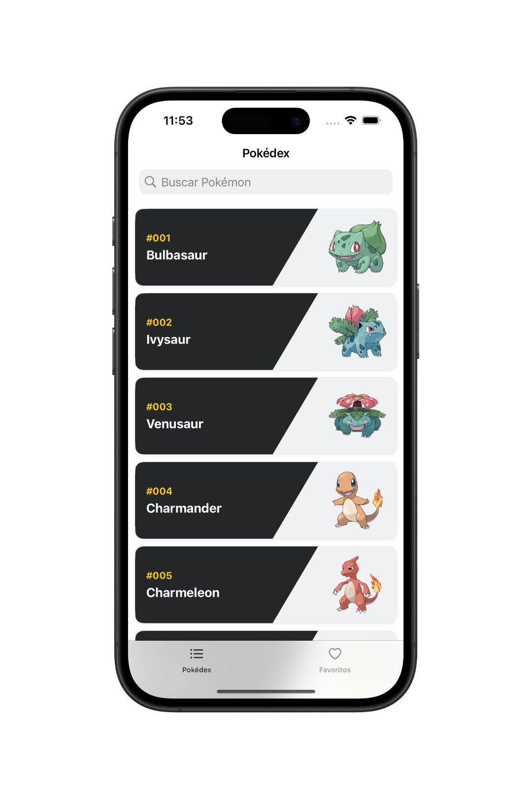
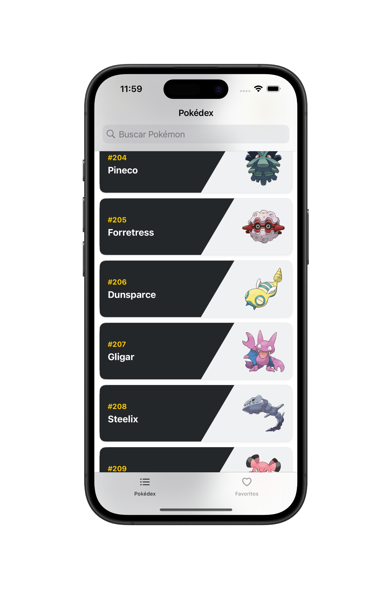
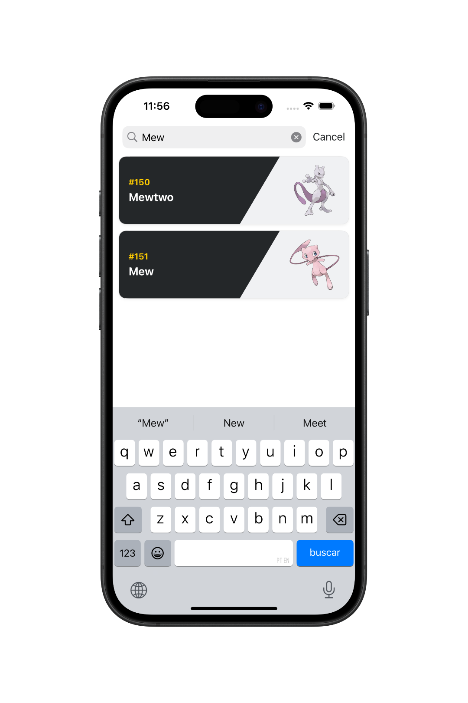
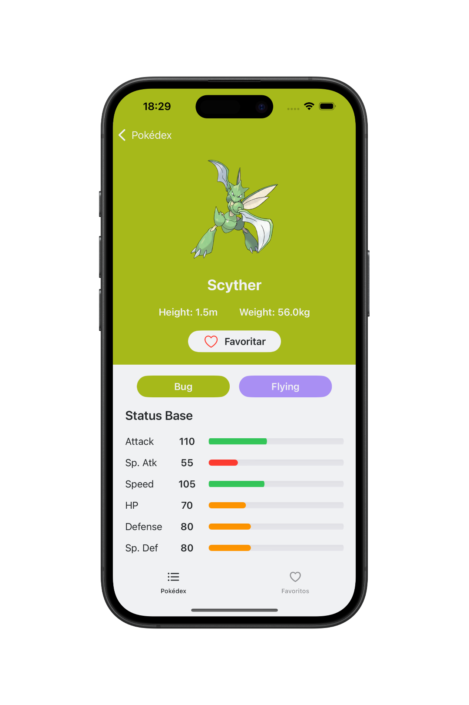
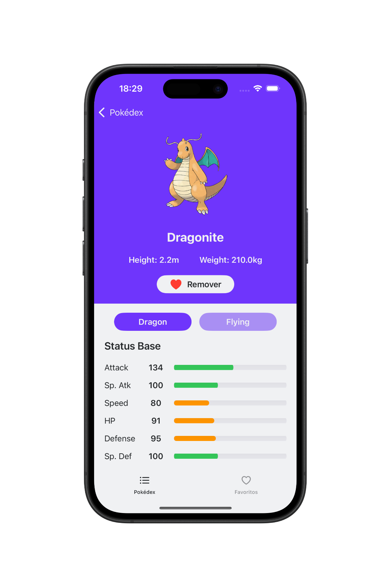
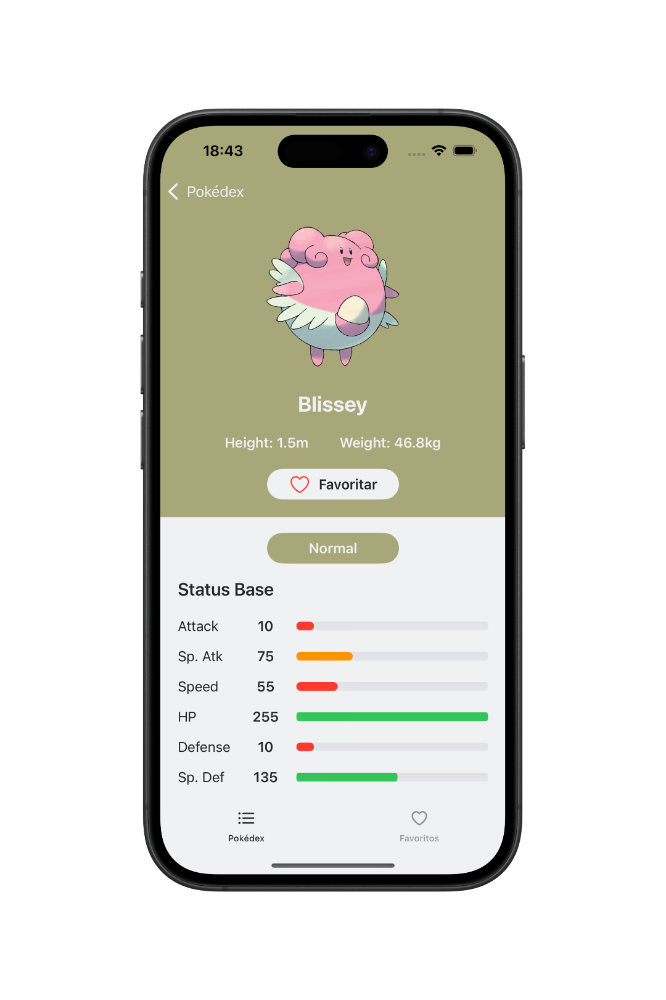
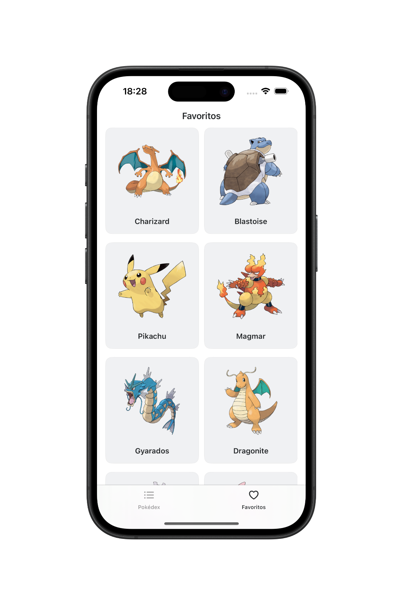

# 📱 Pokédex - App de Pokémons

O **Pokédex** é um aplicativo iOS desenvolvido com **UIKit (ViewCode)** que permite aos usuários explorar e pesquisar uma vasta coleção de Pokémons. Cada criatura possui uma tela dedicada com detalhes como tipo, status base, peso, altura e imagem oficial. Além disso, é possível marcar Pokémons como favoritos, que são exibidos automaticamente na aba de favoritos.

  
  
  
  
  
  
  

## 🛠 Tecnologias Utilizadas

- Swift  
- UIKit
- ViewCode 
- Auto Layout (NSLayoutConstraint)
- UIScrollView
- UITableView e UICollectionView
- UISearchController
- UITabBarController
- Armazenamento Local (UserDefaults)
- Dependência Externa Via SPM (Kingfisher)
- API REST (URLSession: Completion Handler)
- MVVM (Model-View-ViewModel) 

## 👨🏻‍💻 Como Usar o Aplicativo

- Baixe o projeto e abra com o Xcode.
- Execute o aplicativo em um simulador iOS ou iPhone físico.
- Na aba **Pokédex**, explore a lista completa ou utilize a busca para encontrar um Pokémon pelo nome.
- Toque em um Pokémon para visualizar sua imagem oficial, tipo, altura, peso e status base.
- Use o botão para favoritar ou remover um Pokémon da lista de favoritos.
- Acesse a aba **Favoritos** para ver todos os Pokémons que você favoritou.

## 📌 Observação

Este projeto foi desenvolvido com fins educacionais como prática de desenvolvimento iOS utilizando **UIKit com ViewCode**, consumo de **API REST** com completion handler, arquitetura **MVVM**, persistência com **UserDefaults** e boas práticas de componentização e organização em camadas.
